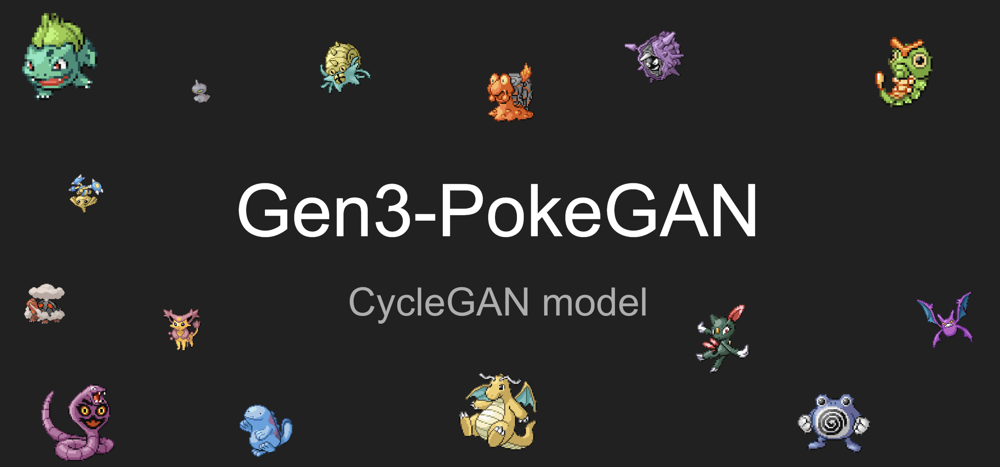
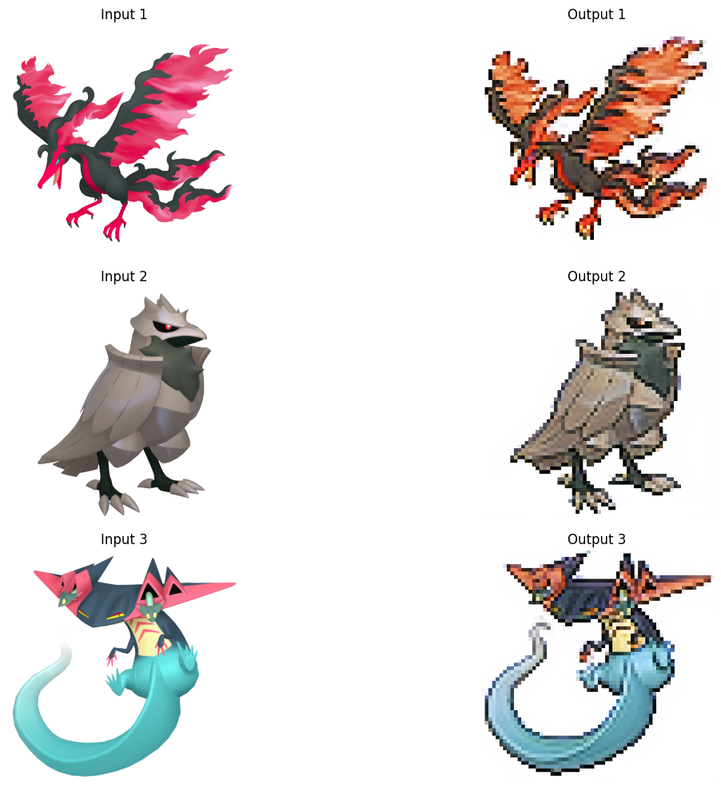

# Gen3-PokeGAN



## Introduction
Gen3-PokeGAN is a machine learning project utilizing CycleGAN architecture to transform modern Pokémon images into the iconic pixel art style of Generation 3 (Gen3), reminiscent of the visuals from Pokémon Ruby and Sapphire. Our goal is to reimagine Pokémon in the nostalgic pixel style that many fans adored, using a model that inputs a 3D model-style image and outputs a pixel art-style image.



## Live Demonstration

Explore Gen3-PokeGAN in action and transform your own Pokémon images through our interactive Streamlit app:

[interactive Gen3-PokeGAN Streamlit app](https://gen3-pokegan.streamlit.app/).

## Project Overview
This repository contains the codebase for the Gen3-PokeGAN project, which includes the following main components:
- CycleGAN Architecture for image translation without paired examples.
- Generative Adversarial Networks (GANs) with dual mapping functions.
- Discriminator models serving as adversarial judges.

## Getting Started

### Prerequisites
Ensure you have the following installed:
- Python 3.8 or higher
- PyTorch 1.7 or higher
- CUDA Toolkit (if using GPU acceleration)

### Installation

Clone the repository and install the required dependencies:

```bash
git clone https://github.com/DataWithAlex/gen3-pokeGAN.git
cd gen3-pokeGAN
pip install -r requirements.txt
```

## Repository Structure

- `train.py`: Here the CycleGAN model undergoes training for transforming 3D model-style Pokémon images into pixel-style ones and vice versa. The script orchestrates the alternating training of discriminator and generator models, measuring image translation quality through loss functions like Mean Squared Error (MSE) and L1 loss. As each epoch progresses, model checkpoints are saved upon validation loss improvements, while training metrics are logged to monitor the training's progress in a file called `training_progress.csv`.

- `generator_model.py`: Here a PyTorch module for the Generator of a CycleGAN is implemented. It comprises several convolutional blocks for down-sampling, residual blocks for feature transformation, and up-sampling blocks for spatial expansion. The Generator takes an input image and generates a transformed output image, aiming to convert 3D Pokémon images into sprite versions and vice versa. Additionally, a detailed test function demonstrates the shape transformations that occur at each stage of the Generator, elucidating the role of each component in the image transformation process.

- `discriminator_model.py`: Here a PyTorch module for the Discriminator of a CycleGAN is constructed. It includes a custom Block class for defining the basic building blocks of the discriminator network. The Discriminator class initializes the network with sequential layers, including convolutional layers followed by instance normalization and leaky ReLU activation. Additionally, a test function is provided to instantiate the discriminator and run a forward pass with random data, demonstrating the shape of the output tensor. 

- `config.py`: Here are the centralized settings for CycleGAN training are defined. The file includes device configuration, dataset paths, hyperparameters such as learning rate and batch size, and scheduler configurations for adjusting learning rates during training. Additionally, functions are provided to update hyperparameters and scheduler parameters conveniently, facilitating hyperparameter tuning.

- `metrics.py`: The metrics.py script, featuring the plot_training_session function, succinctly visualizes Gen3-PokeGAN's loss metrics over time and showcases the model's learning efficacy through concise graphical summaries.

- `dataset.py`: The dataset.py script prepares the data for Gen3-PokeGAN, with the PokemonDataset class loading and transforming Pokémon images using augmentation and normalization to ensure consistent input for the model's training.

- `app.py`: The app.py script utilizes Streamlit to create an interactive web application for Gen3-PokeGAN, allowing users to upload images and view their transformation into the Generation 3 pixel art style. It handles model downloading, image preprocessing, and uses a trained Generator model to produce and display the stylized results. Users interact through a clean interface, with a sidebar for uploads and a main area showcasing the conversion process and results.

- `requirements.txt`: List of dependencies for the project.


